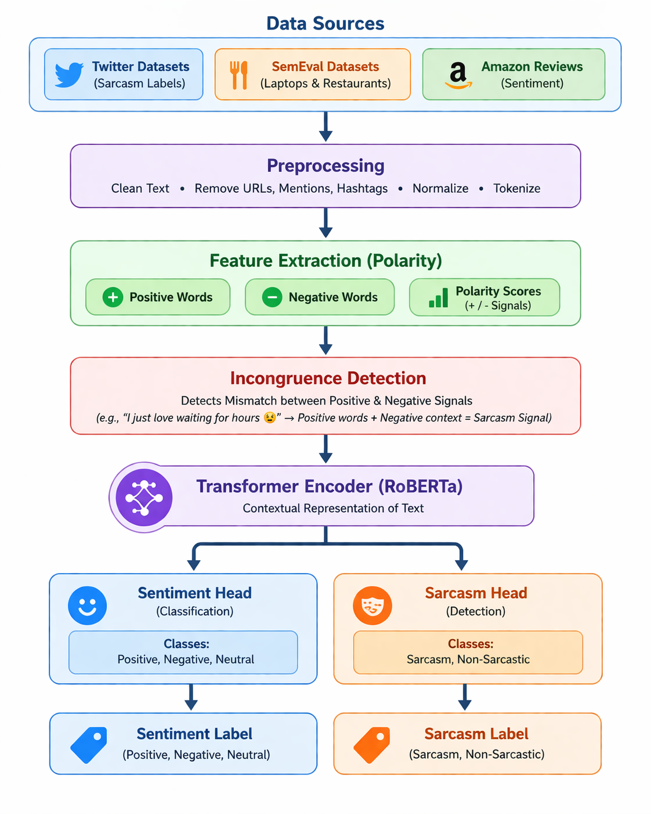

# 🙄 · 😏 · 🥴 Sarcasm Detection — Sentiment Incongruence with Multi-Task RoBERTa

<div align="center">


**Detects sarcasm by catching the mismatch between what text *says* and what it *actually means* — no hand-crafted labels, no schema dependency, full explainability.**

[Features](#-features) • [How It Works](#-how-it-works) • [Results](#-results) • [Installation](#-installation) • [Usage](#-usage) • [Architecture](#-architecture) • [Tech Stack](#-tech-stack) • [Contact](#-contact)

</div>

---

## 📌 Overview

**Sarcasm Detection via Sentiment Incongruence** is an NLP project that tackles one of the hardest problems in sentiment analysis — sarcasm. Instead of relying on fixed annotation columns or dataset-specific labels, this system derives sarcasm labels purely from semantic mismatch between surface-level sentiment and underlying emotion.

The project offers two core contributions:
- 🏷️ **Sentiment Incongruence Auto-Labeler** — Automatically labels sarcasm across any corpus using two transformer pipelines in parallel, with zero dependency on annotation schemas
- 🤖 **Multi-Task RoBERTa Classifier** — Fine-tuned end-to-end with Focal Loss, WeightedRandomSampler, and a Sarcasm-Aware Sentiment Gate for handling implicit polarity inversion

---

## ✨ Features

### 🏷️ Auto-Labeler
- Runs **two transformer pipelines in parallel** — one for surface sentiment, one for underlying emotion
- Fires a sarcasm signal when positive surface language co-occurs with negative emotion
- Fully **schema-independent** — works across any dataset without touching annotation columns
- Hybrid mode: uses structured labels as primary when available, incongruence as fallback

### 🤖 Multi-Task Classifier
- Shared **RoBERTa-base** encoder (125M params) with two task heads
- **Focal Loss** (γ=2) — prevents majority-class collapse on imbalanced data
- **WeightedRandomSampler** — enforces 40% sarcastic ratio per mini-batch
- **Sarcasm-Aware Sentiment Gate** — flips sentiment to `implicit_negative` when P(sarcastic) ≥ 0.45
- Trained jointly on sarcasm detection + auxiliary sentiment classification

### 🔍 LIME Explainability
- Every prediction comes with a token-level attribution map
- Highlights exactly which words drove the sarcasm call
- Human-verifiable, no extra parameters added to the model

### 📊 Cross-Domain Evaluation
- Zero-shot tested on 3 unseen domains — SemEval Laptop, SemEval Restaurant, Amazon Reviews
- Consistent gains over TF-IDF + Logistic Regression baseline across all domains

---

## 🖥️ Demo

### Sarcasm Detection
```
Input  → "Local Politician Promises This Time He Really Means It About Tax Cuts"
Output → 🙄 Sarcastic (P = 0.954)
         LIME flags: "really means it", "this time"
```

### Non-Sarcastic
```
Input  → "Dog Reunited With Owner After Being Missing For Three Days"
Output → ✅ Not Sarcastic (P = 0.095)
         LIME weights: near zero across all tokens
```

---

## 🚀 Installation

### Prerequisites
- Python 3.8 or higher
- GPU recommended (Kaggle T4 or Colab)

### Step 1 — Clone the Repository
```bash
git clone https://github.com/bk1210/sarcasm-sentiment-incongruence.git
cd sarcasm-sentiment-incongruence
```

### Step 2 — Install Dependencies
```bash
pip install -r requirements.txt
```

### Step 3 — Download the Dataset
Get the dataset from Kaggle: [News Headlines Dataset for Sarcasm Detection](https://www.kaggle.com/datasets/rmisra/news-headlines-dataset-for-sarcasm-detection)

Place `Sarcasm_Headlines_Dataset_v2.json` in the project root.

### Step 4 — Run the Notebook
```bash
jupyter notebook nlp.ipynb
```

Or upload directly to **Kaggle** and run with T4 GPU for best performance.

---

## 📖 Usage

### Running the Full Pipeline

1. Open `nlp.ipynb`
2. Run all cells top to bottom — the notebook handles:
   - Data loading and preprocessing
   - Auto-labeling via the Sentiment Incongruence strategy
   - TF-IDF + LR baseline training
   - Multi-task RoBERTa fine-tuning
   - In-domain and cross-domain evaluation
   - LIME explanation generation
## 🔄 Pipeline


### Inference on Custom Text
```python
# After training, run inference on any headline
text = "Government Promises to Fix Economy After Only 20 Years"
result = predict(text, model, tokenizer, device)
print(result)
# → {'label': 'sarcastic', 'confidence': 0.91, 'lime_tokens': [...]}
```

---

## 🏗️ Architecture

### Sentiment Incongruence Auto-Labeler

```
Input Text
    │
    ├─► Surface Sentiment Model (twitter-roberta)   ──┐
    │   → {positive / neutral / negative} + score     │
    │                                                  ├─► Incongruence? → Sarcasm Label
    └─► Emotion Classifier (distilroberta-emotion) ───┘
        → {joy / anger / disgust / fear / ...} + score
```

**Rule:** If surface = positive (p > 0.35) AND emotion ∈ {anger, disgust, fear, sadness} (p > 0.25) → sarcastic

### Multi-Task RoBERTa

```
Input Text
    │
    ▼
[Normalization: URLs → [URL], @mentions → [USER], HTML decode]
    │
    ▼
RoBERTa-base Encoder (125M params, d=768, 12 layers)
    │
    ├──► Sarcasm Head  → Focal Loss (γ=2, weight=0.70)
    │        │
    │        └──► Sarcasm-Aware Sentiment Gate (threshold=0.45)
    │
    └──► Sentiment Head → Cross-Entropy (weight=0.30)
```

### Project Structure

```
sarcasm-sentiment-incongruence/
│
├── nlp.ipynb                              # Full pipeline — labeling, training, eval, LIME
├── requirements.txt                       # Python dependencies
└── README.md                              # Project documentation
```

---

## 📊 Results

### In-Domain Performance (Headlines test set, n=4,293)

| Class | Precision | Recall | F1 |
|---|---|---|---|
| Not Sarcastic | 0.970 | 0.987 | 0.979 |
| Sarcastic | 0.986 | 0.967 | 0.976 |
| **Macro Avg** | **0.978** | **0.977** | **0.977** |
| **AUC-ROC** | | | **0.997** |

### Cross-Domain vs Baseline

| Domain | Model | Accuracy | F1-Macro | ΔF1 |
|---|---|---|---|---|
| Headlines | TF-IDF + LR | 0.905 | 0.904 | — |
| Headlines | **RoBERTa (Ours)** | **0.977** | **0.977** | **+0.073** |
| Amazon | TF-IDF + LR | 0.579 | 0.460 | — |
| Amazon | **RoBERTa (Ours)** | 0.573 | **0.489** | **+0.029** |
| SemEval Laptop | **RoBERTa (Ours)** | 0.910 | 0.490 | +0.003 |
| SemEval Restaurant | **RoBERTa (Ours)** | 0.909 | 0.502 | +0.023 |

### Ablation Study

| Configuration | Val F1 | Δ |
|---|---|---|
| Full model (proposed) | **0.939** | — |
| − Focal Loss | 0.889 | −0.050 |
| − Auxiliary sentiment head | 0.905 | −0.034 |
| − Confidence gate | 0.932 | −0.007 |
| Frozen RoBERTa encoder | 0.743 | −0.196 |

---

## 🛠️ Tech Stack

| Technology | Purpose |
|---|---|
| Python 3.8+ | Core language |
| PyTorch | Training loop, Focal Loss, samplers |
| HuggingFace Transformers | RoBERTa backbone, tokenizer, sentiment/emotion pipelines |
| scikit-learn | TF-IDF + LR baseline, metrics |
| LIME | Token-level explainability |
| Matplotlib / Seaborn | Training curves, confusion matrix |
| Kaggle (T4 GPU) | Training environment |

---

## 📦 Dependencies

```txt
torch>=2.0.0
transformers>=4.35.0
datasets>=2.14.0
numpy>=1.24.0
pandas>=2.0.0
scikit-learn>=1.3.0
matplotlib>=3.7.0
seaborn>=0.12.0
tqdm>=4.65.0
lime>=0.2.0.1
```

Install with:
```bash
pip install -r requirements.txt
```

---

## 🔮 Future Improvements

- [ ] Replace threshold-based incongruence with a learned cross-attention module
- [ ] Domain-adaptive masked language modeling to close the cross-domain gap
- [ ] Graded sarcasm intensity scoring instead of binary labels
- [ ] Extend the auto-labeler to multilingual corpora
- [ ] Streamlit demo app for live inference

---

## 📄 License

This project is licensed under the MIT License — see the [LICENSE](LICENSE) file for details.

---

## 👤 Contact

**Bharath Kesav R**
- 📧 Email: bharathkesav1275@gmail.com
- 🐙 GitHub: [@bk1210](https://github.com/bk1210)
- 🎓 Institution: Amrita Vishwa Vidyapeetham, Coimbatore

---

## 🙏 Acknowledgements

- [HuggingFace](https://huggingface.co) — for the pre-trained transformer models and pipelines
- [cardiffnlp](https://huggingface.co/cardiffnlp) — for the Twitter RoBERTa sentiment model
- [j-hartmann](https://huggingface.co/j-hartmann) — for the emotion classifier
- [Rishabh Misra](https://www.kaggle.com/datasets/rmisra/news-headlines-dataset-for-sarcasm-detection) — for the Sarcasm Headlines dataset

---

<div align="center">

**⭐ If you found this project useful, please give it a star on GitHub! ⭐**

*Built with ❤️ for making NLP models that actually understand what you mean*

</div>
